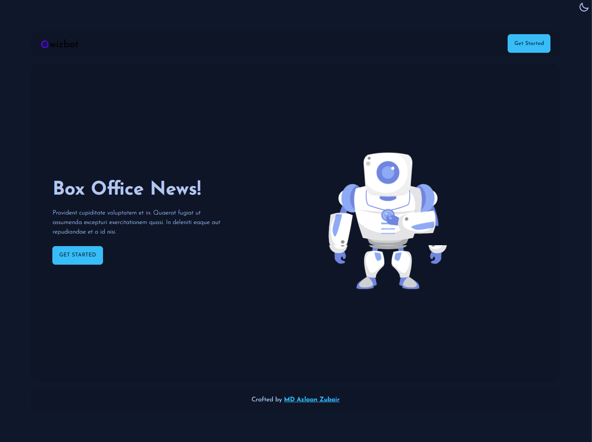

# Qwizbot

An AI-powered SaaS product that helps businesses, students, and professionals perform language-related tasks.
Qwizbot is a web application that helps users enhance their knowledge and communication skills. With its advanced features, Qwizbot enables users to answer questions based on existing knowledge, transform sentences into standard English, translate English text into French, Spanish, and Japanese, and extract keywords from the text. Whether you're a student, professional, or just curious, Qwizbot has something to offer.

## Application Preview

## Features

- Q&A: Answer questions based on existing knowledge. Respond with accurate and concise information.
- Grammifier: Transform sentences into standard English using our advanced algorithm.
- Translator: Translate English text into French, Spanish, and Japanese with our accurate language translation.
- Keywords: Extract keywords from text. Lower temp picks keywords. Higher temp generates related keywords.

## How to Use

Visit the Qwizbot website: [https://qwizbot.netlify.app/](https://qwizbot.netlify.app/)

Create your account and just start using the feature you want to use. Enjoy learning and improving your communication skills!

## Tech Stack

Qwizbot is built using the following technologies:

- HTML
- CSS
- JavaScript
- React
- Supabase
- code-davinci-002

## Future Improvements

Here are some ideas for future improvements to Qwizbot:

- Implementing a speech-to-text and text-to-speech feature.
- Creating a mobile app version of Qwizbot.

## Contributing

We welcome contributions from the open-source community. If you would like to contribute to Qwizbot, please fork the repository and submit a pull request.
